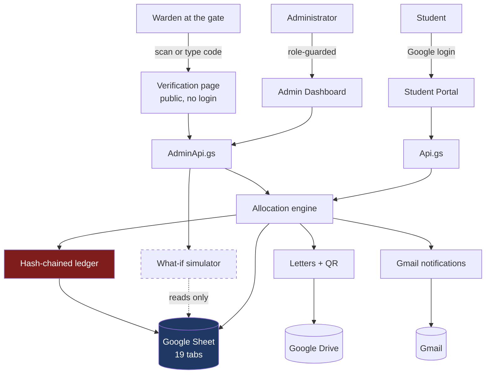

# Technical Documentation

Smart Hostel Allocation & Optimization System — GGSIPU
Smart India Hackathon 2026

---

## 1. What this is

A complete hostel admission lifecycle — application, document verification,
optimised allocation, allotment letters, notifications, waiting list, room swaps
and grievance handling — running entirely inside a free Google account.

No server. No database licence. No paid API. No developer required to operate it.

| | |
|---|---|
| Runtime | Google Apps Script (V8) |
| Database | Google Sheets, 19 tabs |
| Frontend | HTML Service, vanilla JS, no framework |
| Documents | Drive (PDF letters), Gmail (notifications) |
| Source control | Git, pushed with `clasp` |
| Tests | 537 assertions offline, plus a 24-point live self-test |
| Cost | ₹0 |

---

## 2. Architecture



The dashed line is the important one: the simulator **reads** the database and
never writes to it.

### Why Sheets is the right database here

Not a compromise — the requirement. The hostel office already lives in
spreadsheets. Reservation percentages, scoring weights, room inventory and
eligibility thresholds are **rows a non-programmer edits**, and the next run picks
them up with no deployment. That is what "operable without a full-time developer"
means in practice.

### The one architectural decision that shaped everything

`Allocator.run()` is a **pure computation**. It reads, works in memory, and
returns a result object. `Allocator.commit()` is the only writer.

That seam is why the what-if simulator can run a complete 900-student allocation
with zero risk to live state, and why every test can assert on a full run without
a database.

---

## 3. Data model

19 tabs. The full column list lives in `src/Schema.gs`, which is the single
source of truth — `Setup.gs` builds the spreadsheet from it and `Db.gs` reads
through it, so a column can never drift out of sync with the code.

| Group | Tabs |
|---|---|
| Configuration | `Config`, `Policy`, `Admins` |
| People | `Students`, `Applications`, `Preferences`, `Lifestyle`, `Documents` |
| Inventory | `Hostels`, `Rooms`, `Beds` |
| Results | `Runs`, `Allocations`, `Waitlist` |
| Lifecycle | `Transfers`, `Grievances`, `Notifications` |
| Infrastructure | `AuditLog`, `PincodeGeo` |

### Bed-level, not room-level

The atomic allocatable unit is a **bed**, not a room. A room-level model cannot
express *"bed 2 of a 3-seater is free because one student withdrew"* — which is
exactly the vacancy tracking the problem statement asks for. It is also what
makes roommate matching and mutual swaps expressible at all.

### Performance

Apps Script caps a single execution at six minutes, and each `getRange()` call
costs a round trip. `Db.gs` therefore reads a whole tab at once, caches it for
the execution, and writes in bulk. A full 900-student allocation, which touches
every tab, completes in **about one second**.

Work that cannot be bounded — 741 PDFs, 741 emails — is chunked and reports what
remains, so the operator presses the button again rather than watching a timeout.

---

## 4. The allocation engine

`src/Allocator.gs`. Deterministic, seeded, and explainable by construction.

```
A  PARTITION    TWO hard partitions: gender and campus. A student is admitted to
                one campus and can only be housed there, so an allocation that
                crosses campuses is not a worse outcome - it is an impossible
                one. Merit order and quota apportionment stay university-wide;
                only the beds a student may occupy differ.
                Accessibility is a placement constraint (stage E), not a
                partition.

B  SCORE        composite = w_merit·norm(CGPA or entrance rank)
                          + w_distance·norm(min(distance, cap))
                          + w_year·seniority
                          + w_special·specialNeed
                All weights read from the Policy sheet.

C  ORDER        Sort descending. Ties broken by hash(appId + runSeed) — never by
                sheet order, which would advantage whoever applied first, and
                never by Math.random(), which would make the run irreproducible.

D  QUOTA        Largest-remainder apportionment. PwD is horizontal: carved OUT of
                the open share, never added on top.

E  SERIAL DICTATORSHIP
                In score order, each applicant takes their best still-available
                ranked preference.

E2 DERESERVATION
                Reserved seats a category could not fill are converted and
                reissued to the waiting list in strict merit order.

F  LOCAL SEARCH Hunt for Pareto-improving swaps. Expected result: zero.

G  ROOMMATES    Within each (hostel, roomType) outcome, regroup students to
                maximise compatibility. Preference ranks never change.

H  WAITLIST     Ordered queue with an ETA derived from historic churn.
```

### Why serial dictatorship rather than a solver

A CP-SAT solver returns an optimum but cannot tell a student *why*. Serial
dictatorship over ranked preferences is:

- **Strategy-proof** — no student benefits from misreporting their preferences
- **Pareto-efficient** — verified on every run by stage F
- **Explainable in one sentence per student** — *"the applicant at merit position
  118 took the last 2-seater in Hostel A"*

For a problem whose stated pain is *transparency and grievances*, explainability
is worth more than the last few percent of optimality. The solver is separable if
CP-SAT is wanted later.

### Stage F is a proof obligation, not a feature

Stage F searches for any two students who would **both** rather have each other's
room. On a healthy run it finds **zero**, because serial dictatorship is already
Pareto-efficient. The count is reported on the dashboard as evidence.

Honest limit: that guarantee holds over the five preferences students actually
rank. Students who received a fallback assignment expressed no preference over
what they got, so nothing is proven about their outcome. That is a property of
incomplete preference lists, and it is reported rather than hidden.

### Dereservation — the fix worth knowing about

Quotas are a percentage of capacity; the applicant mix never matches those
percentages. The first working version left **16% of the hostel empty** while 215
students waited, because reserved seats in under-subscribed categories went
unused.

```
before   623 allotted   215 waitlisted   82.4% utilisation
after    741 allotted    97 waitlisted   98.0% utilisation
```

Converted seats go out in strict merit order and the student is told their seat
came from conversion.

---

## 5. Explainability

Every stage appends structured reasons as it runs:

```js
{ code: 'SEAT_QUOTA', ok: true,
  text: 'Open seats were exhausted before your merit position, so your seat was
         awarded under the OBC reserved quota.',
  detail: { bucket: 'OBC', category: 'OBC' } }
```

**The explanation is a byproduct of the algorithm, not a report generated
afterwards.** It therefore cannot describe a decision the engine did not make.

Traces are persisted with each allocation and grouped for display by
`buildExplanation_()` in `Api.gs`.

---

## 6. Tamper-evident ledger

`src/Ledger.gs`. Every state change appends a row whose hash covers the previous
row's hash:

```
hash = SHA256(seq | ts | actor | action | payload | prevHash)
```

Editing any historical row breaks that row's hash **and every hash after it**, so
`verify()` reports the exact row where the chain was broken. The dashboard shows
a live badge.

This is what lets an administrator answer *"the allocation was manipulated"* with
evidence rather than assurance.

---

## 7. QR codes and letter verification

`src/QrCode.gs` — a complete QR encoder in plain JavaScript.

- GF(256) Reed-Solomon, block interleaving
- All eight mask patterns with penalty scoring
- Format and version information blocks
- ISO/IEC 18004 byte mode, versions 1–10, levels L and M
- **PNG output built byte by byte** — zlib stored blocks, CRC32, Adler-32

Every hosted QR service is either paid or an external call the demo could die on.
This one touches nothing.

Reed-Solomon is verified against the worked example in **ISO/IEC 18004 Annex I**
and by the syndrome property, which holds for any input rather than one fixed
vector. The PNG is verified by inflating it with Node's zlib and comparing every
pixel back to the matrix.

### Known defect: scanning

**As of 22 Aug 2026 the printed QR does not reliably scan with a phone camera.**

Everything behind it is verified working: the encoder passes the ISO spec vector,
the PNG decodes back to the exact matrix, and the verification endpoint accepts
genuine letters and rejects forgeries. The failure is at the optical step.

Mitigations applied so far — compact `?v=` route, 10-character signature,
error-correction level L, rendered at 186px from a scale-6 image — took the
symbol from version 8 to version 4 and roughly doubled module size to 4.5 px per
module, which should be ample. It still fails, so the remaining suspects are PDF
rasterisation at display time, or contrast/anti-aliasing introduced by the
viewer.

**The feature is not blocked on it.** The verification page accepts the code
typed or pasted by hand (`apiVerifyByCode`), and the code is printed in full
beneath the QR on every letter. Gate staff can verify a letter with no camera at
all — which is arguably what a real deployment needs anyway.

**Diagnosing it:** `Hostel System > Diagnostics > QR diagnostics` separates the
three possible causes — camera cannot resolve the modules, URL is wrong, or
verification rejects the letter.

### Anti-forgery

The letter's QR encodes an HMAC over the allotment reference:

```
?page=verify&id=ALC-RUN-20260821-235350-0019&sig=<HMAC-SHA256, 16 hex>
```

The verification page is **deliberately public** — a warden at the gate must be
able to scan without signing in. Verification fails for a wrong signature, a
signature from a different allotment, a truncated or altered signature, an
invented reference, **and for a correctly signed allotment that has since been
cancelled** — otherwise an old letter would still open the gate.

### Two bugs the tests caught before deployment

1. **One format-info module was over-reserved and left unwritten.** The two
   format copies are not symmetric — 8 modules in the column, 7 in the row.
2. **Version information blocks were missing entirely.** Required from version 7
   up. The 140-character verification URL lands on version 8, so every QR would
   have been unreadable.

### And one the tests could not catch

The QR was first drawn as a grid of coloured table cells. It looked correct in a
browser, and **disappeared completely from the PDF** — Google's HTML-to-PDF
converter drops background colours on empty cells. Only deploying revealed it.
Hence the PNG encoder.

---

## 8. Roommate matching

`src/Roommate.gs`. Six weighted dimensions — sleep schedule, study style,
cleanliness, sociability, food preference and language, with guests and wake
time feeding the sleep and sociability terms.

Smoking is deliberately **not** a dimension. Hostels are non-smoking, so asking
students to declare a tolerance for it would treat a prohibited act as a
lifestyle preference and quietly build it into the pairing score.

Grouping runs **only among students who already received the same (hostel,
roomType) outcome**, so it cannot change anyone's preference rank. Compatibility
is optimised strictly inside the space the allocation already fixed. It can never
trade fairness for comfort.

Greedy seeded matching beats arbitrary pairing by roughly **18 percentage
points** on the demo cohort.

Language is a mild bonus and never a hard rule — grouping students by language
would quietly segregate hostels by region, which a public university should not do.

---

## 9. The what-if simulator

`src/Simulator.gs`.

Baseline and candidate are **both computed fresh from the same seed**, with only
the policy differing. Diffing against the stored committed run would confuse a
policy effect with data that changed since.

The modified policy lives only in memory (`Policy.setOverride`) and is cleared in
a `finally` block, so a simulation cannot leave a mark even if the allocator
throws. Tests force a throw mid-simulation and confirm no override survives.

Output is a **who-moved diff**: *"these fourteen students lose their seat"* is
actionable where a percentage is not.

---

## 10. Swap marketplace

`src/Swap.gs`. Students arrange their own swaps; valid ones execute immediately.

**Auto-approval is safe by construction.** A swap exchanges two students between
two beds. It cannot change seat totals, and it cannot change quota counts —
the entitlement attaches to the student, not the bed. The two things it *can*
break are checked explicitly:

| Check | Why |
|---|---|
| `GENDER` | A hard partition of the allocator |
| `CAMPUS` | A hard partition of the allocator |
| `ACCESSIBILITY` | A student needing an accessible room must keep one |
| `ACCESSIBLE_STOCK` | Accessible rooms cannot be released while someone waits |
| `BOTH_ALLOTTED` | Both parties must hold an active allotment |
| `ROOMS_ACTIVE` | Neither room is out of service |
| `QUOTA_NEUTRAL` | Stated explicitly — it is the first thing a reviewer asks |

Both letters are reissued on execution. A stale letter would still scan as
genuine and send a warden to the wrong door.

---

## 11. Grievance auto-triage

`src/Grievance.gs`. The valuable part is not the classifier.

**An allocation dispute is audited, not answered.** Replaying the stored
explanation would prove nothing — a faulty engine would faithfully describe its
own fault. So triage independently re-verifies:

| Check | What it proves |
|---|---|
| `LEDGER_INTACT` | The audit log covering the run is unbroken |
| `MERIT_ORDER_HELD` | Nobody below them took a seat they were entitled to |
| `PREFERENCES_GENUINELY_FULL` | Missed preferences really were full at their position |
| `PLACEMENT_VALID` / `GENDER_CORRECT` / `ACCESSIBILITY_HONOURED` / `BED_NOT_SHARED` | Their own placement is legal |

Only a clean audit is auto-answered. A failed check **escalates with the anomaly
named** — which is the only case actually worth a warden's time. Tests plant an
irregularity and confirm it escalates rather than being papered over.

This is the payoff of building explainability first: the two features compound.

---

## 12. Security

The web app runs as **Execute as: me**, so a student calling a server function
runs it with the deployer's permissions. Every guard is therefore server-side.

| Attack | Defence |
|---|---|
| Call an admin function directly | `Auth.requireAdmin()` at the top of every one |
| Pass another student's `appId` | `apiGetStudentView` refuses unless admin; there is a test for exactly this |
| Post a wrong-gender hostel preference | Rejected server-side; the client is never trusted |
| Claim a shorter home distance | Distance recomputed from the registry pincode, never accepted from the client |
| Edit preferences after results | Allotted applications lock |
| Forge an allotment letter | HMAC over the reference; verification fails |
| Reuse a cancelled letter | Verification checks allotment status too |
| Edit the audit log | Hash chain detects it and names the row |

`ALLOW_TAMPER_DEMO` gates the deliberate-corruption demo button and is off by
default.

---

## 13. Testing

530 assertions across eight suites, all runnable offline:

| Suite | Checks | Covers |
|---|---|---|
| `harness` | 19 | Schema contract, hash chain, tamper detection |
| `qr` | 57 | QR encoder vs the ISO spec, PNG round-trip |
| `phase1` | 57 | Data integrity, quota arithmetic, determinism |
| `phase2` | 93 | Allocation engine correctness |
| `phase3` | 65 | Document rules, portal API, validation |
| `phase4` | 94 | Letters, QR anti-forgery, email quota, admin |
| `phase5` | 99 | Simulator isolation, swaps, grievance audit |
| `phase6` | 45 | Demo scenario, access guards |

`tests/stubs.js` shims `SpreadsheetApp`, `DriveApp`, `MailApp`, `Utilities` and
`PropertiesService`, and swaps the database for an in-memory store. **The engine
source is loaded unmodified**, so what passes here is the code that runs on
Google.

This mattered more than expected: the allocator iterates in ~50 ms locally
instead of a push-and-wait cycle against a six-minute execution limit.

### Invariants asserted on every run

- No bed double-booked
- No gender partition violation
- Every accessibility requirement honoured
- No quota oversubscribed
- Allocated + waitlisted = eligible pool
- Byte-for-byte reproducibility from the seed
- `run()` provably does not mutate state
- Ledger chain intact after every operation

---

## 14. Known limitations

Stated plainly, because a reviewer will find them anyway.

- **The cohort is synthetic** and hostel names are placeholders. The generator is
  seeded, so the same 900 students appear on every machine. Real inventory is a
  one-sheet swap.
- **Reservation percentages are the standard central norms**, not verified GGSIPU
  figures. They must be checked before any real use.
- **Pincode coordinates are approximate district centroids**, good to a few tens
  of kilometres. Fine for distance banding in a score; not for navigation. A
  student near a district boundary is scored off a nearby centroid.
- **Document upload is built but only lightly exercised** — it needs a real Drive
  round trip that the offline harness cannot reproduce.
- **Email is capped by Google's quota**: ~100/day on a consumer account against
  741 allotments. Workspace raises this to 1500.
- **Cross-campus transfers** beyond mutual swaps are not implemented.
- **OTP login** for students without a Google account is designed but not built.
- **Concurrency** is guarded by `LockService`, but two administrators committing
  simultaneously has not been load-tested.

---

## 15. Source map

```
src/
  Schema.gs        19-tab contract — single source of truth
  Db.gs            batched typed access; nothing else calls getRange()
  Setup.gs         one-click createDatabase()
  Policy.gs        policy load, simulation overlay, snapshot hashing
  Util.gs          seeded PRNG, largest-remainder apportionment
  Geo.gs           offline pincode → distance, no paid API
  SeedData.gs      synthetic GGSIPU cohort
  Eligibility.gs   rules producing reasons, not booleans
  Allocator.gs     stages A–H
  Roommate.gs      compatibility scoring and grouping
  Metrics.gs       fairness and efficiency measures
  Simulator.gs     what-if with who-moved diff
  Swap.gs          mutual swap validation and execution
  Grievance.gs     auto-triage that audits the run
  Documents.gs     per-applicant document requirements
  Letters.gs       HTML→PDF letters with signed QR
  QrCode.gs        QR encoder and PNG writer
  Notify.gs        Gmail templates, batched and quota-aware
  Ledger.gs        hash-chained audit log
  Auth.gs          session resolution and role guards
  Api.gs           student-facing endpoints
  AdminApi.gs      admin endpoints, all guarded
  DemoScenario.gs  named cast for demonstrations
  Main.gs          router and spreadsheet menu
  ui/              index, apply, student, admin, verify, styles
```

---

## 16. Deliverables

| Deliverable | Where |
|---|---|
| Smart Hostel Management Portal | `src/ui/`, deployed web app |
| Automated Allocation Engine | `src/Allocator.gs` |
| Student Self-Service Portal | `src/ui/student.html`, `apply.html` |
| Administrator Dashboard | `src/ui/admin.html` |
| Waiting List & Vacancy Management | `Waitlist` tab, dashboard occupancy view |
| Automated Email Notifications | `src/Notify.gs` |
| Technical Documentation | this file |
| Source Code Repository | Git |
| Deployment Guide | `DEPLOYMENT.md` |
| Demo Video | script in `DEMO_SCRIPT.md` |
